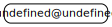

# 源码分析

## 文件结构

``` bash
/Users/liufang/openSource/FunnyLiu/busboy
├── LICENSE
├── README.md
├── deps
|  └── encoding
|     ├── encoding-indexes.js
|     └── encoding.js
├── lib
|  ├── main.js
|  ├── types
|  |  ├── multipart.js
|  |  └── urlencoded.js
|  └── utils.js
└── package.json

directory: 4 file: 15

ignored: directory (1)

```

## 外部模块依赖



## 内部模块依赖


  